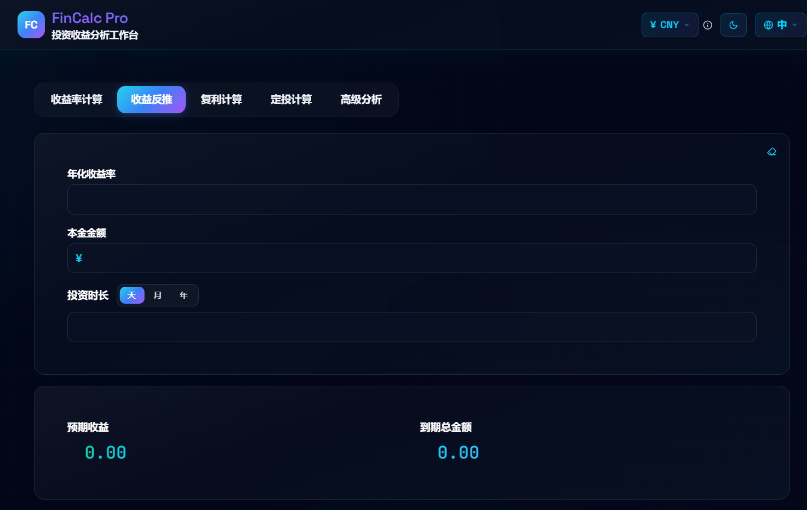
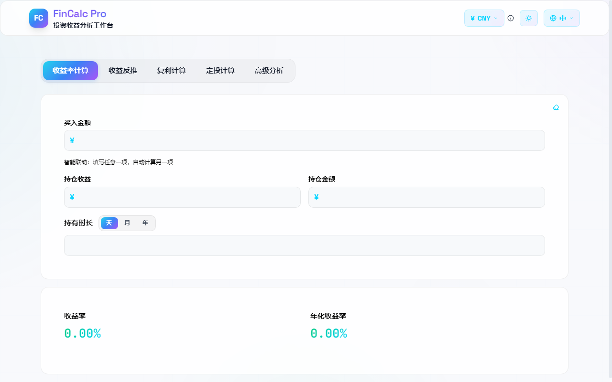
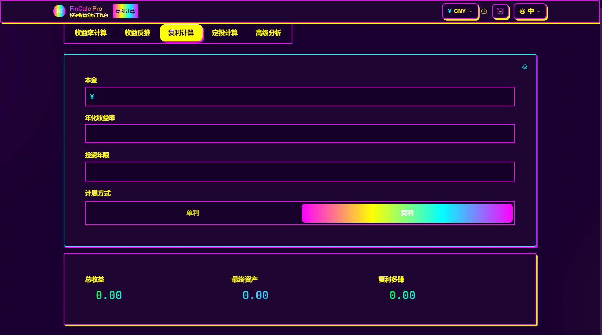
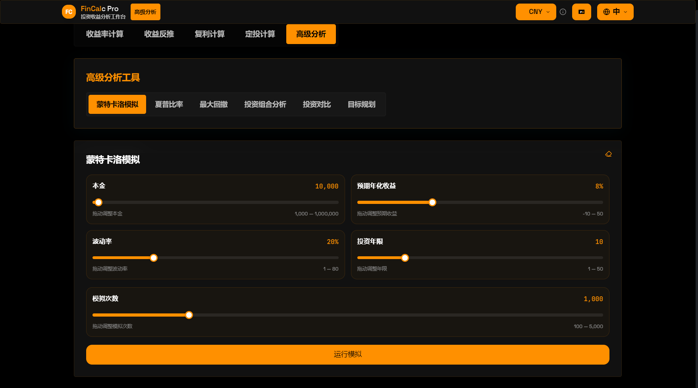

# FinCalc Pro

> Professional Investment Return Analysis Workstation

A professional investment return analysis desktop app built with Tauri + React + TypeScript for Windows.

[中文文档](./README.md)

## Feature Modules

### Return Calculator

The most commonly used quick return calculator. Enter any combination below for real-time results:

- **Buy amount** + **Holding profit** → auto-calculates return rate, annualized return, holding amount
- **Buy amount** + **Holding amount** → auto-derives holding profit, then calculates return rate
- **Holding period** — supports day / month / year unit switching
- Smart linking: fill in any one field, auto-calculate the rest
- Built-in formula display: Return Rate = Holding Profit ÷ Buy Amount × 100%
- Dual chart mode: trend chart + comparison chart
- Auto risk assessment (Loss / Conservative / Stable / Excellent / Extreme)
- Optional inflation adjustment: nominal return vs real return

### Reverse Calculator

Project expected returns given a known annual rate:

- Input: annual rate, principal, investment duration
- Output: expected profit, total maturity amount
- Duration unit: day / month / year switching
- Formula: Profit = Principal × Annual Rate × Time(years)

### Compound Interest Calculator

Visual comparison of simple vs compound interest:

- Input: principal, annual rate, investment years
- Mode toggle: simple interest / compound interest
- Output: total profit, final amount, compound advantage
- Growth chart: simple line vs compound line with highlighted compound area
- Chart annotations: max value marker, average reference line
- Optional inflation adjustment
- Formula display

### DCA (Dollar-Cost Averaging) Calculator

Simulate long-term periodic investment accumulation:

- Input: monthly investment, expected annual rate, investment years
- Output: total invested, final value, profit, return rate, annualized return
- Area chart: total invested (dashed) vs asset value (solid), area difference = profit
- Optional inflation adjustment: nominal vs real return comparison
- Formula: monthly compounding of fixed contributions

## Advanced Analysis Tools

### Monte Carlo Simulation

Predict future return distributions using stochastic simulation:

- 5 adjustable parameters: principal, expected return, volatility, years, simulation count
- Slider controls for each parameter with 400ms debounced auto-calculation
- Simulation output:
  - 5%-95% and 25%-75% probability interval area charts
  - Median curve + principal reference line
  - Median final value, 5th percentile, 95th percentile, probability of loss

### Sharpe Ratio

Measure risk-adjusted return performance:

- Input: historical return series (comma-separated) and risk-free rate
- Output: Sharpe ratio value
- Auto rating: ≥1 excellent, 0.5–1 moderate, <0.5 poor
- Detailed explanation included

### Maximum Drawdown

Analyze the maximum loss interval in asset value:

- Input: asset net value series (comma-separated)
- Output: max drawdown percentage
- Peak period → trough period annotation
- Net value trend chart with drawdown zone highlighted

### Portfolio Analysis

Multi-asset portfolio return and risk analysis:

- Multi-asset input: auto-normalized weights, historical returns per asset
- Output: portfolio expected return, portfolio volatility, portfolio Sharpe ratio
- Weights auto-normalized to sum to 100%

### Investment Comparison

Side-by-side comparison of multiple investments:

- Dynamically add/remove investment entries
- Per entry: principal, return rate, years
- Bar chart comparing profits across investments

### Goal Planner

Reverse-engineer a monthly DCA plan from a target amount:

- Input: target amount, expected annual rate, investment years
- Output: required monthly investment, total invested, expected profit
- Growth chart: cumulative invested line + target line + asset value line
- Formula: Monthly = Target × Monthly Rate ÷ ((1 + Monthly Rate)^Months - 1)

## General Features

### Data Persistence
All calculator inputs auto-save to localStorage — data survives page refresh. Each module has a reset/clear button.

### Multi-Currency
Supports CNY (¥) / USD ($) / EUR (€) / GBP (£) / JPY (JP¥) symbol switching (display only, no FX conversion).

### Internationalization
5 languages: 中文, English, 日本語, 한국어, Français. One-click switch from the header.

### Inflation Adjustment
Return calculator, compound calculator, and DCA calculator all support an optional inflation toggle, using the Fisher approximation to compute real returns.

### Chart System
- ECharts (tree-shaken for minimal bundle): area charts, bar charts, line charts, probability distributions
- Lightweight Charts: return trend charts
- All charts auto-adapt to theme colors
- Annotations: max value markers, average reference lines, break-even lines

## Five Theme Styles

| Dark | Light |
|:---:|:---:|
|  |  |

| Coconut Tree | Retro Flash |
|:---:|:---:|
|  |  |

| PH |
|:---:|
|  |

- **Dark** — Deep blue-black base with cyan/purple gradient accents
- **Light** — Clean gray-white base with blue gradient system
- **Coconut Tree** — Bright yellow background + red thick borders + black hard shadows, retro packaging style
- **Retro Flash** — Deep purple base + magenta/cyan contrast colors, zero border-radius hardcore layout
- **PH** — Pure black + orange solid blocks, minimalist hard-cut style

The theme system uses a centralized ThemeConfig architecture. All color tokens are managed in one place — adding a new theme requires only one config file.

## Tech Stack

| Category | Technology |
|----------|------------|
| Desktop Framework | Tauri 1.x (Rust) |
| Frontend | React 18 + TypeScript |
| Build Tool | Vite |
| Charts | ECharts (tree-shaken) + Lightweight Charts |
| Animation | Framer Motion |
| Styling | Tailwind CSS + CSS Custom Properties |
| i18n | react-i18next |
| Offline Cache | PWA (Workbox) |
| Testing | Vitest + @testing-library/react |

## Project Structure

```
src/
├── themes/              # Theme configurations
│   ├── types.ts         # ThemeConfig interface
│   ├── dark.ts          # Dark theme
│   ├── light.ts         # Light theme
│   ├── yeshu.ts         # Coconut Tree theme
│   ├── niupi.ts         # Retro Flash theme
│   ├── phub.ts          # PH theme
│   └── index.ts         # Theme registry
├── hooks/               # React Hooks
│   ├── useTheme.tsx     # Theme context + switching logic
│   └── useLocalStorage.ts
├── components/
│   ├── modules/         # Main calculator modules
│   │   ├── ReturnCalc.tsx       # Return calculator
│   │   ├── ReverseCalc.tsx      # Reverse calculator
│   │   ├── CompoundCalc.tsx     # Compound interest
│   │   └── DCACalc.tsx          # DCA calculator
│   ├── advanced/        # Advanced analysis tools
│   │   ├── MonteCarlo.tsx       # Monte Carlo simulation
│   │   ├── SharpeRatio.tsx      # Sharpe ratio
│   │   ├── MaxDrawdown.tsx      # Max drawdown
│   │   ├── PortfolioAnalysis.tsx # Portfolio analysis
│   │   ├── InvestmentComparison.tsx # Investment comparison
│   │   ├── GoalPlanner.tsx      # Goal planner
│   │   └── AdvancedPanel.tsx    # Advanced tools panel
│   ├── charts/          # Chart components
│   │   ├── GrowthChart.tsx      # Growth curve
│   │   ├── ReturnChart.tsx      # Return trend
│   │   ├── MonteCarloChart.tsx  # Monte Carlo probability chart
│   │   ├── TVChart.tsx          # TradingView-style chart
│   │   └── TrendChart.tsx      # Trend chart
│   ├── layout/          # Layout
│   │   ├── Header.tsx           # Top navigation bar
│   │   ├── TabBar.tsx           # Desktop tab bar
│   │   └── BottomBar.tsx        # Mobile bottom bar
│   ├── shared/          # Shared components
│   │   ├── ResetButton.tsx      # Clear button (eraser icon)
│   │   ├── UnitToggle.tsx       # Day/Month/Year toggle pill
│   │   ├── CurrencySelector.tsx # Currency selector
│   │   ├── LangSelector.tsx     # Language selector
│   │   └── RiskBadge.tsx        # Risk level badge
│   └── ui/              # Base UI components
│       ├── GlassCard.tsx        # Frosted glass card
│       ├── AnimatedInput.tsx    # Animated input
│       ├── AnimatedNumber.tsx   # Number roll animation
│       └── ThemeToggle.tsx      # Theme selector dropdown
├── utils/
│   ├── calculations.ts  # Core calculation functions
│   ├── formatters.ts    # Formatting utilities
│   └── risk.ts          # Risk rating
├── i18n/
│   └── locales/         # zh / en / ja / ko / fr
├── styles/
│   └── globals.css      # Global styles + theme variables
└── test/                # Unit tests + component tests
```

## Development

```bash
# Install dependencies
npm install

# Start dev mode (hot reload + Tauri window)
npm run tauri dev

# Frontend only
npm run dev

# Run unit tests
npx vitest run

# Type check
npx tsc --noEmit

# Production build (frontend)
npx vite build
```

## Build Windows Installer

### Prerequisites

- [Node.js](https://nodejs.org/) 18+
- [Rust](https://rustup.rs/) (stable)
- MinGW-w64 (GNU toolchain) — `windres` must be in PATH
  - With MSYS2: `pacman -S mingw-w64-x86_64-gcc`
  - Ensure `C:\msys64\mingw64\bin` is in system PATH

### Build

```bash
# GNU toolchain (requires windres)
export PATH="/c/msys64/mingw64/bin:$PATH"
npx tauri build --bundles nsis
```

The installer will be at `src-tauri/target/release/bundle/nsis/FinCalc Pro_1.0.0_x64-setup.exe`.

## License

MIT
